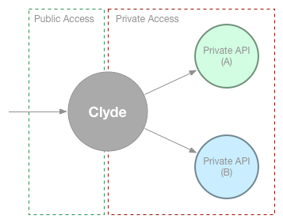
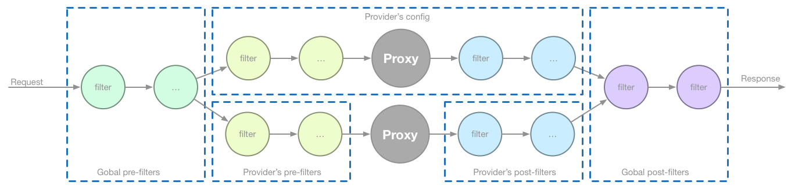
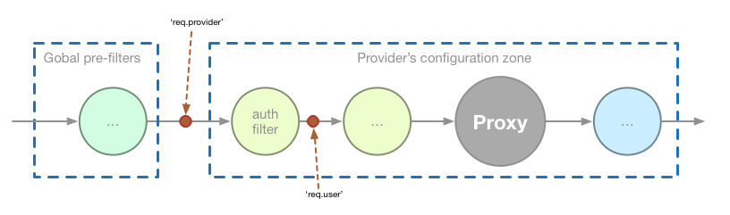

# Clyde

Clyde is an open source NodeJS based API gateway.

When developing an API the most important part resides on designing and implementing the business logic and operations. This is true but we know real life projects requires also many other things that can become defiant challenges: logging, authentication, rate limiting, etc.

Clyde allows to concentrate on the implementation of our API business logic, leaving the rest of work to Clyde.

> **Disclaimer !!!**
>
> Clyde is currently a proof of concept. It is unstable and in heavy development process to implement a first core version.
>
> 

<!-- TOC depth:6 withLinks:1 updateOnSave:1 orderedList:0 -->

- [Clyde](#clyde)
- [Introducing Clyde](#introducing-clyde)
	- [Concepts](#concepts)
		- [Provider (or Private API)](#provider-or-private-api)
		- [Public API](#public-api)
		- [Consumer](#consumer)
		- [Filter](#filter)
	- [The data flow](#the-data-flow)
	- [Conventions](#conventions)
		- [Provider](#provider)
		- [Authentication](#authentication)
	- [Creating custom filters](#creating-custom-filters)
- [Using Clyde](#using-clyde)
	- [Standalone Application](#standalone-application)
	- [Connection listener (or middleware)](#connection-listener-or-middleware)
- [Configuration](#configuration)
	- [Filter object](#filter-object)
	- [Provider object](#provider-object)
	- [Configuration example](#configuration-example)
- [Available filters](#available-filters)
	- [Filters proposal](#filters-proposal)
- [License](#license)
<!-- /TOC -->

# Introducing Clyde

> **Note:** Impressed by the [Kong](http://getkong.org/) project and by the need to protect a private API I started *Clyde* project. I choose Clyde name because it is, like Kong, the name of one of the most famous movie apes.

Clyde is an API gateway, which means it receives requests and redirects to the right API implementation meanwhile applies any number of so called *filter* before and/or after redirecting the request.



The power of Clyde resides in the way it manages the filters, making it extremely modular and configurable.

In addition, Clyde filters are really easy to extend so anyone can implement its own filters to satisfy their needs.

## Concepts

Let's go to describe briefly the set of buzzwords related to Clyde:

### Provider (or Private API)

By *provider* or *private API* we mean a well implemented API which is not ready to be wide open publicly.

For example, a company can have an API implementing its business operations but lacks from authentication, logging, rate limiting, etc.

### Public API

A public API is a wide open accessible API.

Clyde acts as a public API gateway receiving requests and redirecting to the corresponding provider (private API).

### Consumer

A consumer is any client who access resources from an exposed provider, that is, that consumes an API.

### Filter

Filters are a piece of software executed before and/or after a request is redirected to a provider and that can modify the `request` and `response` objects

> Note, a filter is nothing more than a *middleware* function. Clyde core and also many of its filters are implemented using the [connect](https://github.com/senchalabs/connect) project, so the concept of middleware is inherited from it.

Filters can be classified depending on the moment Clyde executes them, that is, before (*pre*) or after (*post*) request is proxied to the provider:

* **prefilters**: Those filters designed to be executed before Clyde proxies the request to the provider (the private API) and allow to manipulate the request: checking headers, changing query parameters, log request, etc.

* **postfilters**: Filters designed to be executed after Clyde proxies the request to the provider (the private API) and allow to manipulate the response: adding headers, removing data, etc.

In addition, we can also classify filters as *global* or *provider* filter, depending on if they affect the whole set of configured providers (*global*) or only affect a concrete provider:

* **global pre/postfilter**: Those filters applied outside the so called *providers configuration zone*.

* **provider pre/postfilter**: Those filters applied inside the so called *providers configuratin zone*.


## The data flow

The next figure summarizes the steps a request follows each time arrives to Clyde gateway.



* Request passes through each *global prefilter* in the same order they are configured.
* Request is redirected to the right provider and enters the *providers configuration zone*.
* Request passes through each *provider's prefilter* in the same order they are configured.
* Request is proxied to the private API.
* Request passes through each *provider's postfilter* in the same order they are configured.
* Request passes through each *global postfilter* in the same order they are configured.

As we can see, working with global/provider prefilter/postfilters give us maximum flexibility to implement any possible configuration.

Note a filter is designed to make an action and it is up to you decide at which place to execute. This way, we can configure two filters, of the same type  but with different options, and execute them at different places. For example, one *access log* filter as global prefilter to log all requests (no matter the provider) and another *access log*  filter executed as a provider's prefilter to log only the requests addressed to that concrete provider.


## Conventions

You are free to implement custom filters following your own rules but, as many times, conventions are a good thing so everybody can work following the same patterns.

### Provider

Some plugins, like a *rate limiter*, could be flexible enough to be applied on a given provider. For example, we can limit the number of requests/second a provider can reveice, that is, the number of request/seconf Clyde can redirect to a provider.

To achieve this, the filter needs to know a bit about the provider the request is addressed. For this purpose, each time a request enters in the *provider configuration zone* (see picture) a new property `provider` is set within the middleware's `request` object.



The `req.provider` object contains at least the next properties:

```javascript
req.provider = {
  providerId: 'some unique value',
  context: '/some/context',
  target: 'http://some_server:port'
};
```

This way, any filter that makes actions depending on the provider information can use the `req.provider` property to know about it.

### Authentication

In the same way and, continue using a supposed *rate limiter* filter, it could be flexible enough to limit the request/second a user, that is a consumer, can make on a given provider.

Clyde follows the convention that **any module that authenticates consumers (the users) must add a `user` object to the `request` object**:


The `req.user` object must contains at least a property `userId`:

```javascript
req.user = {
  userId: 'some value',
  ...
};
```

This way, any subsequent filter that wants to make actions depending on the consumer can use `req.user.userId` to know the current user.

> Some authentication filters uses the [passport](https://github.com/jaredhanson/passport) module, which adds `req.user` to the request. We simply follow the same convention.


## Creating custom filters

Create new filters is extremely simple (and more if you are a NodeJS developer with some experience using *connect* or *express*).

A filter requires to create a module that exports an `init(name , config)` method responsible to return a middleware function:

```javascript
/**
 + My custom filter.
 +
 + @param  {String} id Identifier of the filter
 + @param  {Object} config JavaScript object with filter configuration
 + @returns {middleware} Middleware function implementing the filter.
 */
module.exports.init = function(id, config) {
    return function(req, res, next) {
        // Do whatever. I'm a filter !!!
    };
};
```

The `init()` method receives the `name` of the filter we have used in the configuration and the `configuration` options we have specified. It is up to you do whatever with the filter configuration and middleware.

---

# Using Clyde

Clyde can be used as standalone application or as a connection listener (or middleware).

## Standalone Application

To use Clyde as standalone application you need to execute the `bin/index.js` script.

> Check the `bin/index.js` script has execution permissions or execute it using `> node bin/index.js` otherwise.

The `bin/index.js` script requires one parameter that must be the JSON configuration file to be used to configure Clyde.

Run `bin/index.js --help` to run the usage options of the program:

```
>  ./bin/index.js --help
Usage: bin/index.js [options] config_file

Options:
  --logfile   Path to the log file. Default 'clyde.log'.
  --loglevel  Level used for clyde log messages. Default 'info'.
  --port      Port where clyde will listen. Default 8080.
  --help      Show help

Examples:
  bin/index.js config.json              Start clyde reading configuration from 'config.json' file.
  bin/index.js --log debug config.json  Start clyde with log messages on 'debug' level and reading configuration from 'config.json' file.
```

> Note, `logfile` and `loglevel` can also be specified in the configuration file but are overridden by the command line options if present.

## Connection listener (or middleware)

Clyde can also be used as a connection listener, in an HTTP/S server, or as a middleware on an express or connect based applications. To do so you must:

* Install Clyde as an npm dependency of your application.
* Require the `clyde` module.
* Create a Clyde middleware (initialized with desired options) with `createMiddleware()` method:

```javascript
var clyde = require("clyde");
var options = {
  // Configuration options
};
var middleware = clyde.createMiddleware(options);
```

The `createMiddleware()` method returns a function with the signature `function(req, res, next) {...}` that can be used both as a connection listener or as middleware. So, at this point we can create a HTTP server using the `middleware` variable:

```javascript
var server = http.createServer(middleware);
server.listen(9999);
```

# Configuration

The goal of the configuration options is to define the flow data must follow through the global prefilters, the provider's confiruation zone and the global postfilters.

As standalone application Clyde requires specify the configuration in a JSON file. As a connection listener it requires a JavaScript object. In both cases the allower structure and properties are the same.

The configuration options are:

* `prefilters`: An array of *filter objects* that will be executed as global prefilters. Optional property.
* `postfilters`: An array of *filter objects* that will be executed as global postfilters. Optional property.
* `providers`: An array of *provider objects* with the configuration need to route a request to approppriate private API. It is the only mandatory property and must contain at least one provider configuration.
* `logfile`: Path to the log file. Optional property. Default 'clyde.log'.
* `loglevel`: Level used for clyde log messages. Optional property. Default 'info'.

> As standalone application, `logfile` and `loglevel` can be specified on command line. In that case command line values override values specified in the configuration file.

## Filter object

A filter object contains information need so Clyde can load and execute a given filter. The allowed properties are:

* `id`: String identifying the filter among all other filters. It is a mandatory property.
* `path`: Path need to load the filter module. It is a mandatory property. Modules are loaded using `require()`. Paths starting with a dot `.` will be loaded relatively to the `$CLYDE/filters` directory. Otherwise modules are loaded following node rules. For example: `path: "some_filter"` will try to load the module from the `node_modules` directory.
* `config`: An object with the filter configuration properties. The allowed properties depends on each filter. Optional property.

> When filters are initialized, `id` and `config` properties are passed to the filter's exported method `init(id, config)`.

## Provider object

For each private API we desire to make publicly available we must configure a provider object. The allowed properties are:

* `id`: String identifying the provider among all other providers. It is a mandatory property.
* `context`: The path part (from the beginning) that is used to discriminate the private API we want to route the request.
* `target`: The address where to proxy the requests that follows the previous `context`.
* `prefilters`: An array of *filter objects* that will be executed as global prefilters. Optional property.
* `postfilters`: An array of *filter objects* that will be executed as global postfilters. Optional property.

## Configuration example

Next we show a sample JSON configuration that allows Clyde to redirect request to two private APIs, which resides at `http://providerA:8080` and `http://providerB:8080`.

Clyde is working with `loglevel` at `debug` level, which means we will see messages each time a request enters or exits a filter or is redirected to a provider.

A global prefilter is configured to log each request that arrives to Clyde server, which are stored at `./tmp/log` directory following the pattern `access-%DATE%.log`.

All the requests that follows the patter `http://clyde_server/A/*` are redirected to the *providerA*. In addition this provider has configured a CORS filters, which allows to make XHR request from a borwser.

On the other side, all requests that follows the pattern `http://clyde_server/B/*` are redirected to the *providerB*. This provider has configured an HTTP authentication prefilter, which means all requests must have authentication attached. The authentication filter is configured to work using basic authentication method and only one user is allowed to pass, the `userA`.

```json
{
	"loglevel" : "debug",
  "prefilters" : [
    {
      "id" : "logger",
      "path" : "clyde-simple-access-log",
      "config" : {
        "directory" : "./tmp/log",
        "file" : "access-%DATE%.log"
      }
    }
  ],

  "providers" : [
    {
      "id" : "providerA",
      "context" : "/A",
      "target" : "http://providerA:8080",
      "prefilters" : [
        {
          "id" : "cors",
          "path" : "clyde-cors"
        }
      ]
    },
    {
      "id" : "providerB",
      "context" : "/B",
      "target" : "http://providerB:8080",
      "prefilters" : [
				{
          "id": "http-auth",
          "path": "clyde-simple-http-auth",
          "config": {
            "realm": "providerB",
            "method": "basic",
            "consumers": {
              "userA": "passwordA"
            }
          }
        }
			]
    }
  ]
}
```

# Available filters

* [Simple Access Log](https://github.com/acanimal/clyde-simple-access-log). Stores request access information (like any HTTP server).
* [Simple Rate Limit](https://github.com/acanimal/clyde-simple-rate-limiter). Limits access globally, by consumer or by providers.
* [Simple HMAC Authentication](https://github.com/acanimal/clyde-hmac-auth). Authenticates consumers following HMAC security scheme.
* [Simple HTTP Authentication](https://github.com/acanimal/clyde-simple-http-auth). Authenticates consumers using basic or digest authentication methods.
* [CORS](https://github.com/acanimal/clyde-cors). Enables Cross Origin Resource Sharing (CORS) whic allows AJAX requests.
* [Request Size Limit](https://github.com/acanimal/clyde-request-size-limiter). Block requests depending on its body length.


## Filters proposal

* API KEY security.
* Transformers. The private API can have methods with parameters we don't want to make public. The goal of this filter is to translate a public parameter/s to the corresponding private parameter/s, for example, translate from a public `date` param to a private `initialDate/finalDate` parameters.
* Validators. Allows to limit the allowed requests, for example, supposing a `date` parameter we can limit the number of days we can query.
* JSONP. Adapt responses to JSONP.


# License

The MIT License (MIT)

Copyright (c) 2015 Antonio Santiago (@acanimal)

Permission is hereby granted, free of charge, to any person obtaining a copy
of this software and associated documentation files (the "Software"), to deal
in the Software without restriction, including without limitation the rights
to use, copy, modify, merge, publish, distribute, sublicense, and/or sell
copies of the Software, and to permit persons to whom the Software is
furnished to do so, subject to the following conditions:

The above copyright notice and this permission notice shall be included in all
copies or substantial portions of the Software.

THE SOFTWARE IS PROVIDED "AS IS", WITHOUT WARRANTY OF ANY KIND, EXPRESS OR
IMPLIED, INCLUDING BUT NOT LIMITED TO THE WARRANTIES OF MERCHANTABILITY,
FITNESS FOR A PARTICULAR PURPOSE AND NONINFRINGEMENT. IN NO EVENT SHALL THE
AUTHORS OR COPYRIGHT HOLDERS BE LIABLE FOR ANY CLAIM, DAMAGES OR OTHER
LIABILITY, WHETHER IN AN ACTION OF CONTRACT, TORT OR OTHERWISE, ARISING FROM,
OUT OF OR IN CONNECTION WITH THE SOFTWARE OR THE USE OR OTHER DEALINGS IN THE
SOFTWARE.
